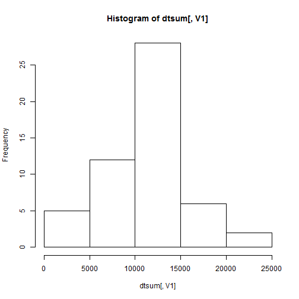
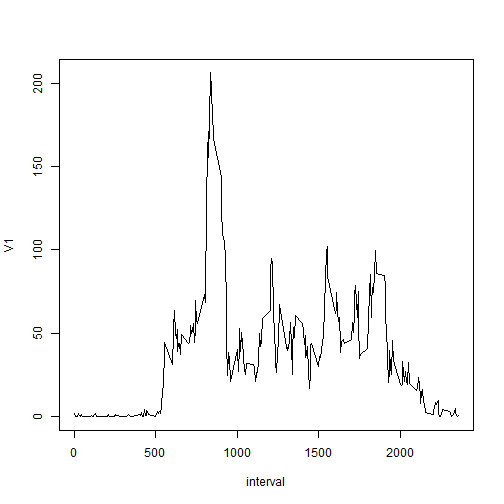
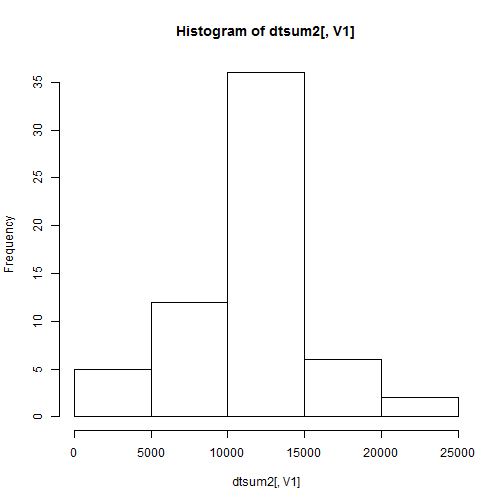
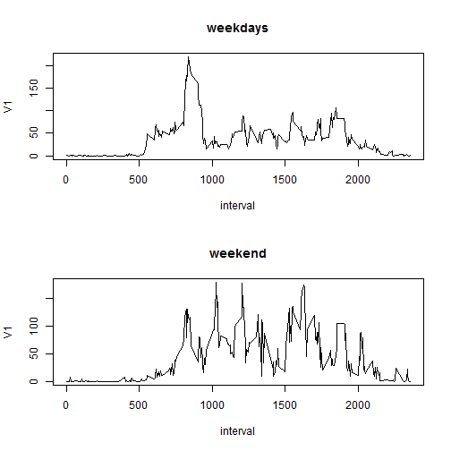

# Reproducible Research: Peer Assessment 1


## Loading and preprocessing the data


```r
dcsv<-read.csv('activity.csv', header = TRUE)
library(data.table)
```

```
## Warning: package 'data.table' was built under R version 3.0.3
```

```r
dtable<-data.table(dcsv)
```
## What is mean total number of steps taken per day?


```r
dtsum<-dtable[, sum(steps), by=date]
dtsum[,V1]
```

```
##  [1]    NA   126 11352 12116 13294 15420 11015    NA 12811  9900 10304
## [12] 17382 12426 15098 10139 15084 13452 10056 11829 10395  8821 13460
## [23]  8918  8355  2492  6778 10119 11458  5018  9819 15414    NA 10600
## [34] 10571    NA 10439  8334 12883  3219    NA    NA 12608 10765  7336
## [45]    NA    41  5441 14339 15110  8841  4472 12787 20427 21194 14478
## [56] 11834 11162 13646 10183  7047    NA
```

```r
hist(dtsum[,V1])
```

 

### mean

```r
mean(dtsum[,V1],na.rm=TRUE)
```

```
## [1] 10766
```
### median

```r
median(dtsum[,V1],na.rm=TRUE)
```

```
## [1] 10765
```
## What is the average daily activity pattern?

### plot by interval


```r
dtmean<-dtable[,mean(steps,na.rm = TRUE),by = interval]
plot(dtmean,type= "l")
```

 

### Interval with max steps

```r
dtmean[(dtmean[,V1]==max(dtmean[,V1]))==TRUE][,interval]
```

```
## [1] 835
```

## Imputing missing values

### Number of missing values

```r
sum(is.na(dtable[,steps]) == TRUE)
```

```
## [1] 2304
```

### Filling missing values by average of intervals by all days


```r
#dtmean[dtmean[,interval == 5]][,V1]
#dtable[dtable[,interval == 5]]

Dtable<-transform(dtable,steps = as.double(steps),date = as.Date(date))
dtable2<-Dtable

sapply(Dtable,mode)
```

```
##     steps      date  interval 
## "numeric" "numeric" "numeric"
```

```r
for(i in dtmean[,interval])
  {
  dt_intl<-Dtable[Dtable[,interval == i]]
  dt_intl_cond<-is.na(dt_intl[,steps]) == TRUE
  #Dt_intl<-transform(dt_intl,steps=as.double(steps))
  fill<-as.double(dtmean[dtmean[,interval == i]][,V1])
  #print(fill)
  dtable2[dtable2[,interval == i]][dt_intl_cond][,"steps"] <- as.double(fill)
  
  }

sum(is.na(dtable2[,steps]))
```

```
## [1] 0
```

### histogram of dataset with no missing values

```r
dtsum2<-dtable2[, sum(steps), by=date]
#dtsum2[,V1]
hist(dtsum2[,V1])
```

 

```r
dtable2
```

```
##          steps       date interval
##     1: 1.71698 2012-10-01        0
##     2: 0.33962 2012-10-01        5
##     3: 0.13208 2012-10-01       10
##     4: 0.15094 2012-10-01       15
##     5: 0.07547 2012-10-01       20
##    ---                            
## 17564: 4.69811 2012-11-30     2335
## 17565: 3.30189 2012-11-30     2340
## 17566: 0.64151 2012-11-30     2345
## 17567: 0.22642 2012-11-30     2350
## 17568: 1.07547 2012-11-30     2355
```

```r
dtable
```

```
##        steps       date interval
##     1:    NA 2012-10-01        0
##     2:    NA 2012-10-01        5
##     3:    NA 2012-10-01       10
##     4:    NA 2012-10-01       15
##     5:    NA 2012-10-01       20
##    ---                          
## 17564:    NA 2012-11-30     2335
## 17565:    NA 2012-11-30     2340
## 17566:    NA 2012-11-30     2345
## 17567:    NA 2012-11-30     2350
## 17568:    NA 2012-11-30     2355
```
## Are there differences in activity patterns between weekdays and weekends?

```r
dtable2[,weekdays:=1]
```

```
##          steps       date interval weekdays
##     1: 1.71698 2012-10-01        0        1
##     2: 0.33962 2012-10-01        5        1
##     3: 0.13208 2012-10-01       10        1
##     4: 0.15094 2012-10-01       15        1
##     5: 0.07547 2012-10-01       20        1
##    ---                                     
## 17564: 4.69811 2012-11-30     2335        1
## 17565: 3.30189 2012-11-30     2340        1
## 17566: 0.64151 2012-11-30     2345        1
## 17567: 0.22642 2012-11-30     2350        1
## 17568: 1.07547 2012-11-30     2355        1
```

```r
dtable2[weekdays(dtable2[,date]) == "Sunday"][,"weekdays"] = 2
dtable2[weekdays(dtable2[,date]) == "Sunday"]
```

```
##       steps       date interval weekdays
##    1:     0 2012-10-07        0        2
##    2:     0 2012-10-07        5        2
##    3:     0 2012-10-07       10        2
##    4:     0 2012-10-07       15        2
##    5:     0 2012-10-07       20        2
##   ---                                   
## 2300:   176 2012-11-25     2335        2
## 2301:    94 2012-11-25     2340        2
## 2302:    26 2012-11-25     2345        2
## 2303:     0 2012-11-25     2350        2
## 2304:     0 2012-11-25     2355        2
```

```r
dtable2_wy<-dtable2[dtable2[,weekdays] == 1]
dtable2_wd<-dtable2[dtable2[,weekdays] == 2]

dtmean_wy<-dtable2_wy[,mean(steps),by = interval]
dtmean_wd<-dtable2_wd[,mean(steps),by = interval]

par(mfrow=c(2,1))
plot(dtmean_wy,type= "l")
title("weekdays")
plot(dtmean_wd,type= "l")
title("weekend")
```

 
